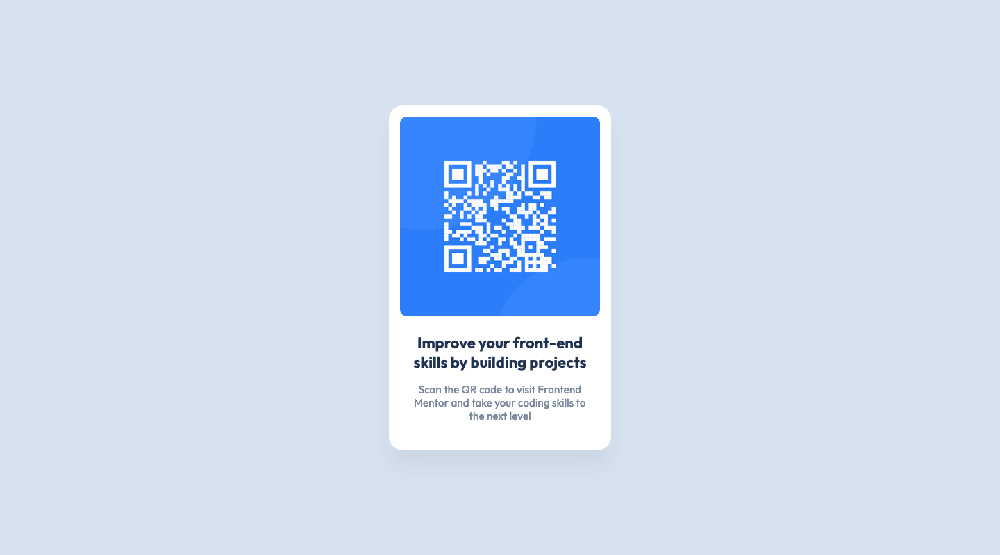

# Frontend Mentor - QR code component solution

This is a solution to the [QR code component challenge on Frontend Mentor](https://www.frontendmentor.io/challenges/qr-code-component-iux_sIO_H). Frontend Mentor challenges help you improve your coding skills by building realistic projects.

## Overview

### Screenshot

### Links

- Solution URL: https://www.frontendmentor.io/solutions/first-challenge-small-issues-remaining-hlmh7Kr23_
- Live Site URL: https://maxnorderfeldt.github.io/qr-code-component-main/

### Built with

- CSS and HTML

### What I learned

Learned a lot about tweaking fonts

### Useful resources

I spent some time trying to get it pixel perfect but after trying to tweak the settings for a while i gave up. The resources below was a lot of help(Thanks to Grace on slack for the link)
https://www.joshwcomeau.com/css/pixel-perfection/

## Author

- Frontend Mentor - [@yourusername](https://www.frontendmentor.io/profile/maxNorderfeldt)

